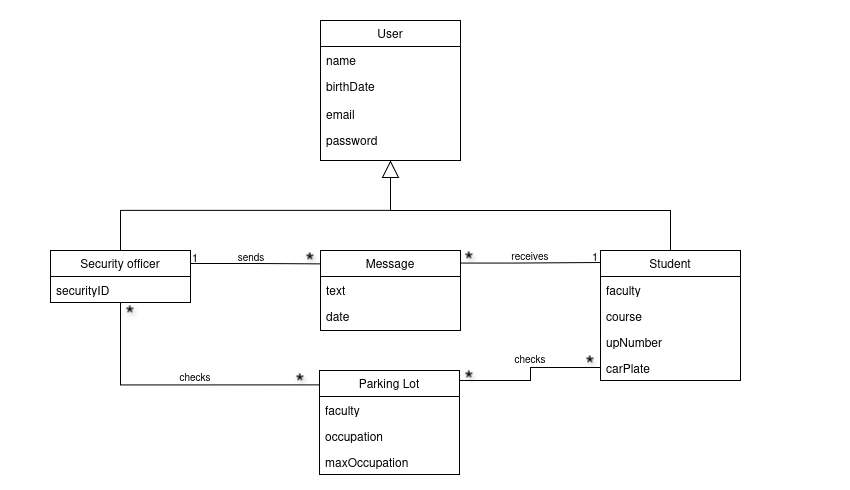
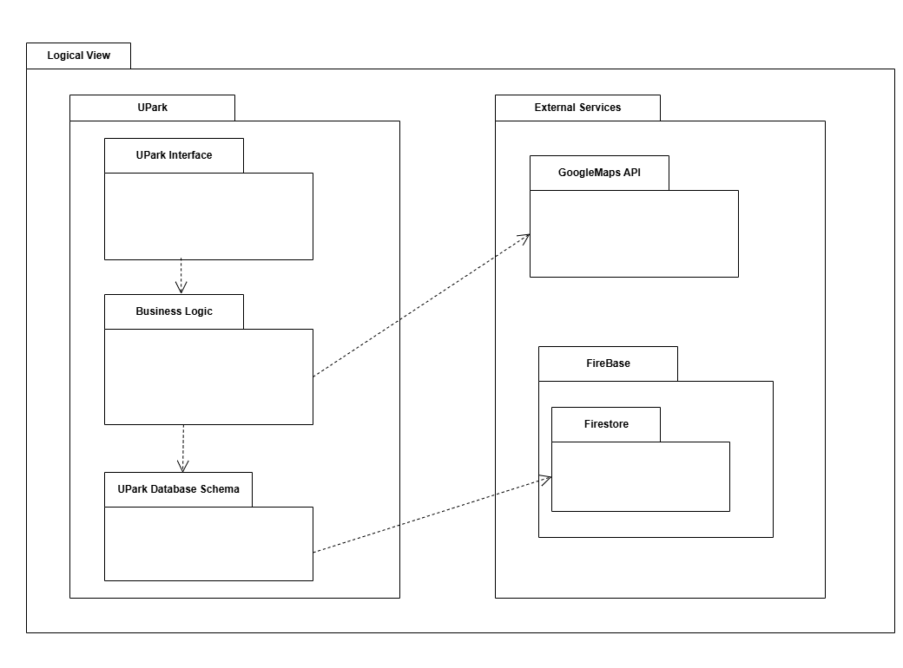

# UPark Development Report

Welcome to the documentation pages of UPark!

This Software Development Report, tailored for LEIC-ES-2024-25, provides comprehensive details about UPark, from high-level vision to low-level implementation decisions. It’s organised by the following activities. 

* [Business modeling](#Business-Modelling) 
  * [Product Vision](#Product-Vision)
  * [Features and Assumptions](#Features-and-Assumptions)
  * [Elevator Pitch](#Elevator-pitch)
* [Requirements](#Requirements)
  * [User stories](#User-stories)
  * [Domain model](#Domain-model)
* [Architecture and Design](#Architecture-And-Design)
  * [Logical architecture](#Logical-Architecture)
  * [Physical architecture](#Physical-Architecture)
  * [Vertical prototype](#Vertical-Prototype)
* [Project management](#Project-Management)
  * [Sprint 0](#Sprint-0)
  * [Sprint 1](#Sprint-1)
  * [Sprint 2](#Sprint-2)
  * [Sprint 3](#Sprint-3)
  * [Sprint 4](#Sprint-4)
  * [Final Release](#Final-Release)

Contributions are expected to be made exclusively by the initial team, but we may open them to the community, after the course, in all areas and topics: requirements, technologies, development, experimentation, testing, etc.

Please contact us!

Thank you!

* Afonso Miguel Almeida Pereira - up202305652@up.pt
* Ana Margarida da Costa Ribeiro - up202305264@up.pt
* Leandro Filipe Pais Resende - up202306343@up.pt
* Mateus Sousa Pereira Guerra - up202303440@up.pt
* Tomás Freire Noronha Jardim - up202306202@up.pt

---
## Business Modelling

Business modeling in software development involves defining the product's vision, understanding market needs, aligning features with user expectations, and setting the groundwork for strategic planning and execution.

### Product Vision
Making student commutes stress-free with real-time parking insights at the University of Porto.

### Features and Assumptions

**High-Level Features**
- **User aunthentication:** Create an account linked to an email address and personal information.
- **Parking lot selection:** Choose a parking lot to check its availability.
- **Availability display:** View the availability of the selected parking lot as a percentage.
- **Interactive Parking Lot Map:** View an interactive map displaying available parking lots, allowing users to easily locate and select a parking spot based on real-time data 
- **Security notificatins via chat:** A chat where you will receive messages from the parking lot security about any information regarding your car.
- **Sort by avaliability:** Sort parking lots by availability.
- **Favorite parking lots:** Add a specific parking lot to favorites section.
- **Security Alerts:** Parking security can send real-time messages to users regarding their vehicle, such as incidents, parking violations, or important updates.

**Assumptions of dependencies**

- Internet Connectivity.
- The app relies on Firebase for backend services including database, authentication and notifications.
- Google Maps API.
<!-- 
Indicate an  initial/tentative list of high-level features - high-level capabilities or desired services of the system that are necessary to deliver benefits to the users.
 - Feature XPTO - a few words to briefly describe the feature
 - Feature ABCD - ...
...

Optionally, indicate an initial/tentative list of assumptions that you are doing about the app and dependencies of the app to other systems.
-->

### Elevator Pitch

🚗 **UPark – Smarter Parking for a Smarter Campus** 🏫  

Finding parking on campus shouldn’t be a daily struggle. **UPark** is an intelligent parking management app designed for the **University of Porto** community, making campus parking hassle-free, efficient, and secure.  

With **real-time parking availability**, instant vehicle notifications, and easy incident reporting, students can park faster and worry less. Security officers can monitor parking areas seamlessly and send alerts directly to vehicle owners, eliminating mass emails and improving response times.  

No more guesswork, endless searching, or unnecessary stress—just smart, effortless parking at your fingertips.  

🚀 **UPark – because parking should be the easiest part of your day!**  

## Requirements

### User Stories
<!-- 
In this section, you should describe all kinds of requirements for your module: functional and non-functional requirements.

For LEIC-ES-2024-25, the requirements will be gathered and documented as user stories. 

Please add in this section a concise summary of all the user stories.

**User stories as GitHub Project Items**
The user stories themselves should be created and described as items in your GitHub Project with the label "user story". 

A user story is a description of a desired functionality told from the perspective of the user or customer. A starting template for the description of a user story is *As a < user role >, I want < goal > so that < reason >.*

Name the item with either the full user story or a shorter name. In the “comments” field, add relevant notes, mockup images, and acceptance test scenarios, linking to the acceptance test in Gherkin when available, and finally estimate value and effort.

**INVEST in good user stories**. 
You may add more details after, but the shorter and complete, the better. In order to decide if the user story is good, please follow the [INVEST guidelines](https://xp123.com/articles/invest-in-good-stories-and-smart-tasks/).

**User interface mockups**.
After the user story text, you should add a draft of the corresponding user interfaces, a simple mockup or draft, if applicable.

**Acceptance tests**.
For each user story you should write also the acceptance tests (textually in [Gherkin](https://cucumber.io/docs/gherkin/reference/)), i.e., a description of scenarios (situations) that will help to confirm that the system satisfies the requirements addressed by the user story.

**Value and effort**.
At the end, it is good to add a rough indication of the value of the user story to the customers (e.g. [MoSCoW](https://en.wikipedia.org/wiki/MoSCoW_method) method) and the team should add an estimation of the effort to implement it, for example, using points in a kind-of-a Fibonnacci scale (1,2,3,5,8,13,20,40, no idea).

-->

In this project, the requirements were documented as *User Stories*, to prioritize user's needs and goals rather than focusing on technical details. This approach allows the requirements to be shorter, easier to understand and easily adaptable to changes.

The User Stories used in this project are present in a Scrum Board, that also contains user interface mockups, acceptance tests and an estimate of the value and effort, for each one of the user stories.

The link to our GitHub Project that constains the Scrum Board can be found [here](https://github.com/orgs/LEIC-ES-2024-25/projects/47).

### Domain model

The UPark application serves two user types: University of Porto security officers and students. 
Security officers can notify students about events related to their cars, while students can only receive this notifications. Both have access to information about the university's parking lots.

* **User** - Stores personal information about users.
  * **Security Officer** - Inherits user information and includes a unique security ID.
  * **Student** - Inherits user information and stores student details along with their car plate.
* **Message** - Represents a notification sent by a security officer to a student.
* **Parking Lot** - Maintains real-time information on its occupancy rate.

  

## Architecture and Design
<!--
The architecture of a software system encompasses the set of key decisions about its organization. 

A well written architecture document is brief and reduces the amount of time it takes new programmers to a project to understand the code to feel able to make modifications and enhancements.

To document the architecture requires describing the decomposition of the system in their parts (high-level components) and the key behaviors and collaborations between them. 

In this section you should start by briefly describing the components of the project and their interrelations. You should describe how you solved typical problems you may have encountered, pointing to well-known architectural and design patterns, if applicable.
-->

### Logical architecture
<!--
The purpose of this subsection is to document the high-level logical structure of the code (Logical View), using a UML diagram with logical packages, without the worry of allocating to components, processes or machines.

It can be beneficial to present the system in a horizontal decomposition, defining layers and implementation concepts, such as the user interface, business logic and concepts.

Example of _UML package diagram_ showing a _logical view_ of the Eletronic Ticketing System (to be accompanied by a short description of each package):

-->

The user interface shows the visual elements and handles the user's interactions; the Business Logic processes those interactions and handlesthe app's functionalities while also integrating the Google Maps API, Data Movements are handled by FireBase Database

  

### Physical architecture
<!--
The goal of this subsection is to document the high-level physical structure of the software system (machines, connections, software components installed, and their dependencies) using UML deployment diagrams (Deployment View) or component diagrams (Implementation View), separate or integrated, showing the physical structure of the system.

It should describe also the technologies considered and justify the selections made. Examples of technologies relevant for ESOF are, for example, frameworks for mobile applications (such as Flutter).

Example of _UML deployment diagram_ showing a _deployment view_ of the Eletronic Ticketing System (please notice that, instead of software components, one should represent their physical/executable manifestations for deployment, called artifacts in UML; the diagram should be accompanied by a short description of each node and artifact):

-->

### Vertical prototype
<!--
To help on validating all the architectural, design and technological decisions made, we usually implement a vertical prototype, a thin vertical slice of the system integrating as much technologies we can.

In this subsection please describe which feature, or part of it, you have implemented, and how, together with a snapshot of the user interface, if applicable.

At this phase, instead of a complete user story, you can simply implement a small part of a feature that demonstrates thay you can use the technology, for example, show a screen with the app credits (name and authors).
-->

## Project management
<!--
Software project management is the art and science of planning and leading software projects, in which software projects are planned, implemented, monitored and controlled.

In the context of ESOF, we recommend each team to adopt a set of project management practices and tools capable of registering tasks, assigning tasks to team members, adding estimations to tasks, monitor tasks progress, and therefore being able to track their projects.

Common practices of managing agile software development with Scrum are: backlog management, release management, estimation, Sprint planning, Sprint development, acceptance tests, and Sprint retrospectives.

You can find below information and references related with the project management: 

* Backlog management: Product backlog and Sprint backlog in a [Github Projects board](https://github.com/orgs/FEUP-LEIC-ES-2023-24/projects/64);
* Release management: [v0](#), v1, v2, v3, ...;
* Sprint planning and retrospectives: 
  * plans: screenshots of Github Projects board at begin and end of each Sprint;
  * retrospectives: meeting notes in a document in the repository, addressing the following questions:
    * Did well: things we did well and should continue;
    * Do differently: things we should do differently and how;
    * Puzzles: things we don’t know yet if they are right or wrong… 
    * list of a few improvements to implement next Sprint;

-->

### Sprint 0

### Sprint 1

### Sprint 2

### Sprint 3

### Sprint 4

### Final Release