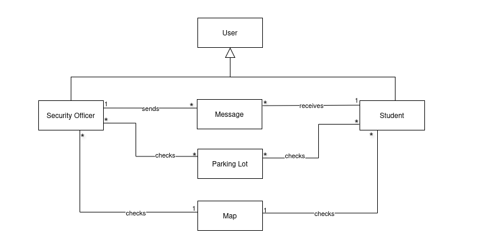
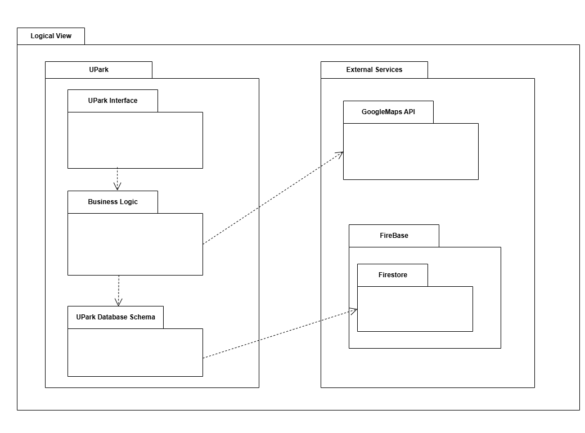
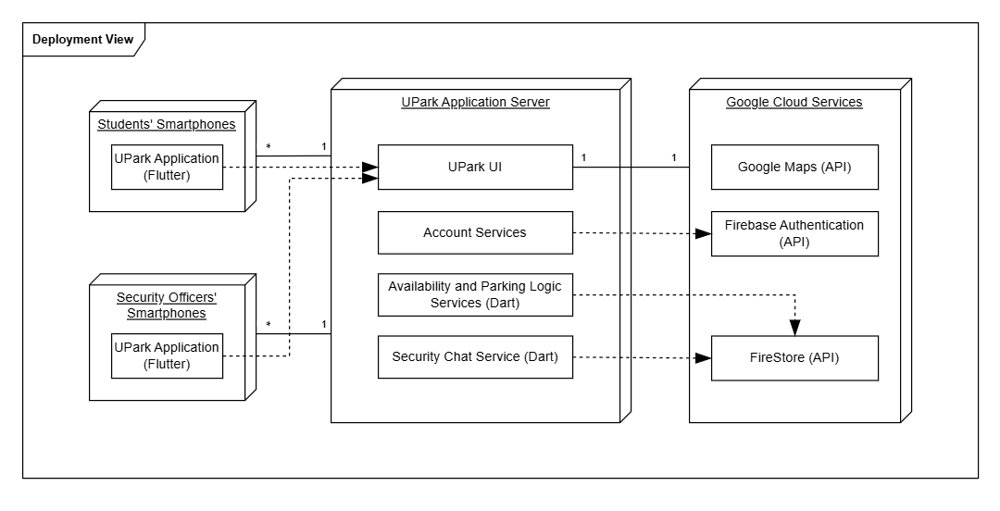
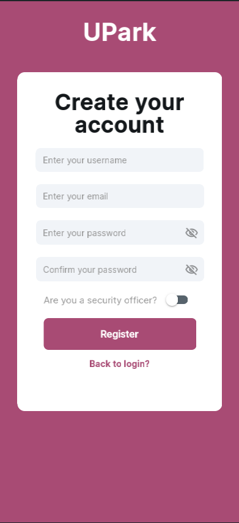
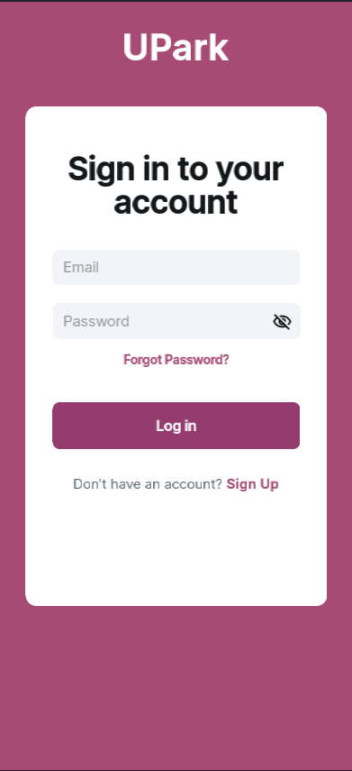
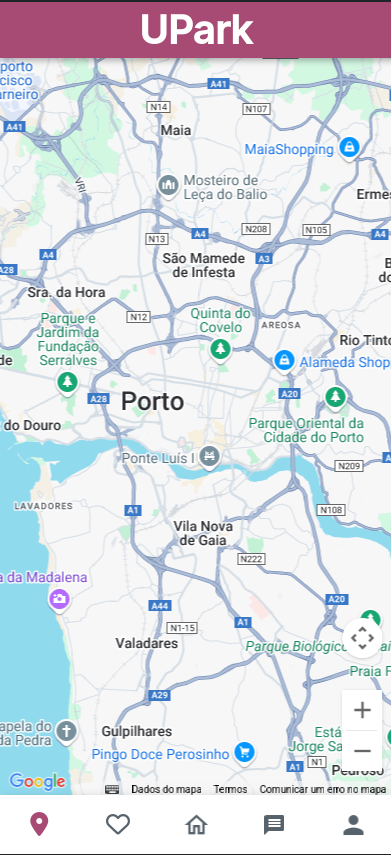
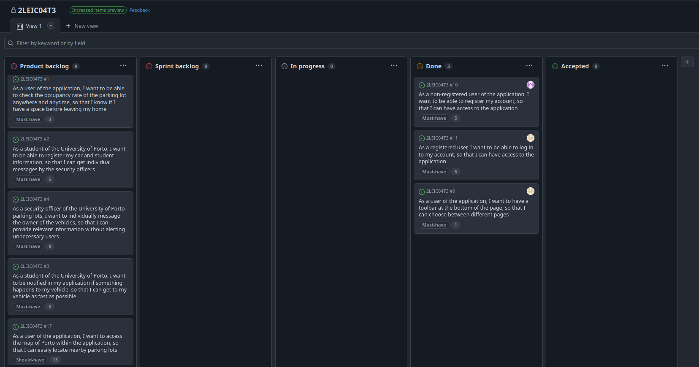
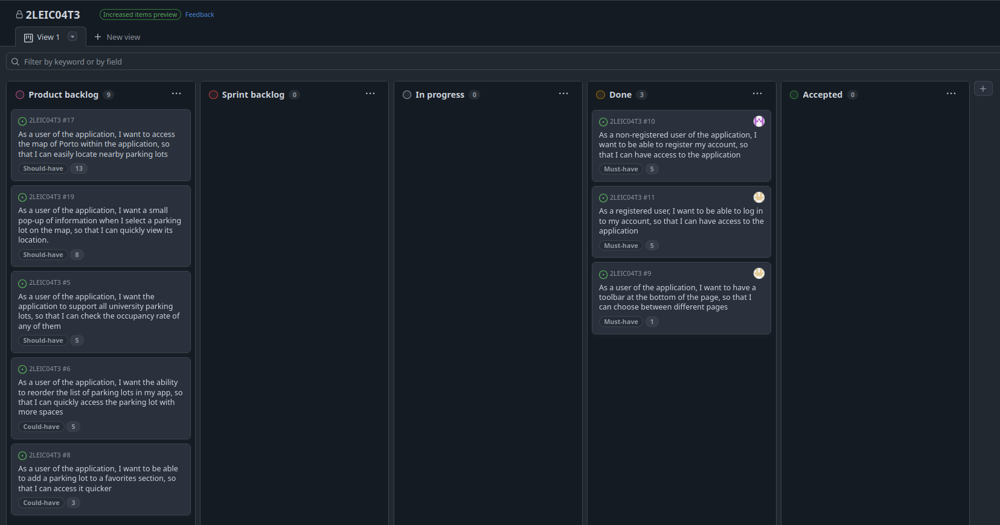
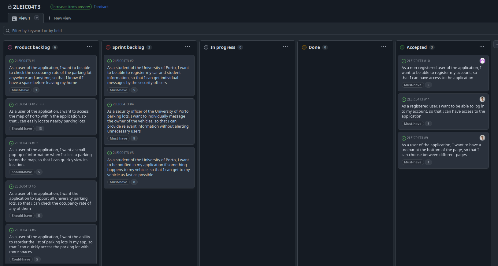
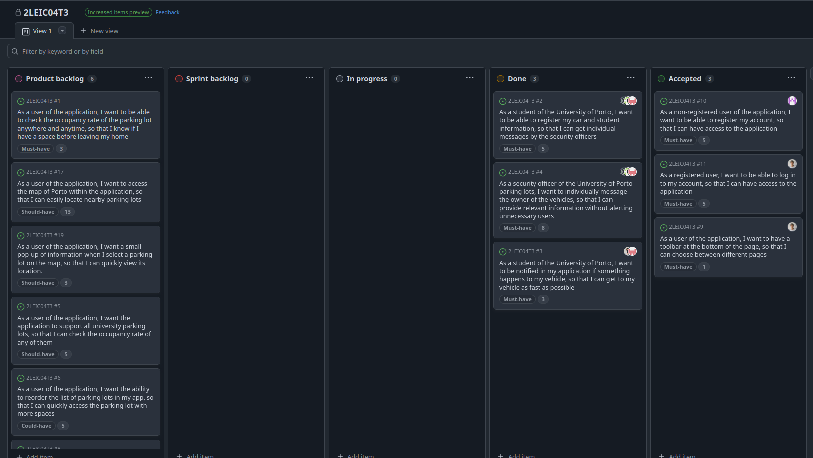

# UPark Development Report

Welcome to the documentation pages of UPark!

This Software Development Report, tailored for LEIC-ES-2024-25, provides comprehensive details about UPark, from high-level vision to low-level implementation decisions. It’s organised by the following activities. 

* [Business modeling](#Business-Modelling) 
  * [Product Vision](#Product-Vision)
  * [Features and Assumptions](#Features-and-Assumptions)
  * [Elevator Pitch](#Elevator-pitch)
* [Requirements](#Requirements)
  * [User stories](#User-stories)
  * [Domain model](#Domain-model)
* [Architecture and Design](#Architecture-And-Design)
  * [Logical architecture](#Logical-Architecture)
  * [Physical architecture](#Physical-Architecture)
  * [Vertical prototype](#Vertical-Prototype)
* [Project management](#Project-Management)
  * [Sprint 0](#Sprint-0)
  * [Sprint 1](#Sprint-1)
  * [Sprint 2](#Sprint-2)
  * [Sprint 3](#Sprint-3)
  * [Final Release](#Final-Release)

Contributions are expected to be made exclusively by the initial team, but we may open them to the community, after the course, in all areas and topics: requirements, technologies, development, experimentation, testing, etc.

Please contact us!

Thank you!

* Afonso Miguel Almeida Pereira - up202305652@up.pt
* Ana Margarida da Costa Ribeiro - up202305264@up.pt
* Leandro Filipe Pais Resende - up202306343@up.pt
* Mateus Sousa Pereira Guerra - up202303440@up.pt
* Tomás Freire Noronha Jardim - up202306202@up.pt

---
## Business Modelling

### Product Vision

**Making student commutes stress-free with real-time parking insights at the University of Porto.**

### Features and Assumptions

**High-Level Features**
- **User authentication:** Create an account linked to an email address and personal information.
- **Parking lot selection:** Choose a parking lot from a list of all the university's parking lots.
- **Availability display:** View the availability of the selected parking lot as a percentage.
- **Interactive Parking Lot Map:** View an interactive map displaying available parking lots, allowing users to easily locate and select a parking spot based on real-time data 
- **Security notifications via chat:** A chat where you will receive messages from the parking lot security about any information regarding your car.
- **Sort by avaliability:** Sort parking lots by availability.
- **Favorite parking lots:** Add a specific parking lot to a favorites section.
- **Security Alerts:** Parking security can send real-time messages to users regarding their vehicle, such as incidents, parking violations, or important updates.

**Assumptions of dependencies**

- Internet Connectivity.
- Firebase for database management and user authentication.
- Google Maps API.

### Elevator Pitch

🚗 **UPark – Smarter Parking for a Smarter Campus** 🏫  

Finding parking on campus shouldn’t be a daily struggle. **UPark** is an intelligent parking management app designed for the **University of Porto** community, making campus parking hassle-free, efficient, and secure.  

With **real-time parking availability**, instant vehicle notifications, and easy incident reporting, students can park faster and worry less. Security officers can monitor parking areas seamlessly and send alerts directly to vehicle owners, eliminating mass emails and improving response times.  

No more guesswork, endless searching, or unnecessary stress—just smart, effortless parking at your fingertips.  

🚀 **UPark – because parking should be the easiest part of your day!**  

## Requirements

### User Stories

In this project, the requirements were documented as *User Stories*, to prioritize user's needs and goals rather than focusing on technical details. This approach allows the requirements to be shorter, easier to understand and easily adaptable to changes.

The User Stories used in this project are present in a Scrum Board, that also contains user interface mockups, acceptance tests and an estimate of the value and effort, for each one of the user stories.

The link to our GitHub Project that constains the Scrum Board can be found [here](https://github.com/orgs/LEIC-ES-2024-25/projects/47).

### Domain model

The UPark application serves two user types: University of Porto security officers and students. 
Security officers can notify students about events related to their cars, while students can only receive these notifications. Both have access to information about the university's parking lots and a city map of Porto, which displays their locations.

* **User** - Stores personal information about users.
  * **Security Officer** - Inherits user information and includes a unique security ID.
  * **Student** - Inherits user information and stores student details along with their car plate.
* **Message** - Represents a notification sent by a security officer to a student.
* **Parking Lot** - Maintains real-time information on its occupancy rate.
* **Map** - Displays the locations of the parking lots.

  

## Architecture and Design

### Logical architecture

The UPark system is structured into the following components:

* **UPark Interface**: Manages user interactions, UI components, and state management for a seamless experience, including parking lot selection, availability display, and favorite parking lots.

* **Business Logic**: Handles core system functionalities such as parking availability checks, sorting by availability, and integration with Google Maps.

* **UPark Database Schema**: Defines the structure of the database, storing user profiles, parking details, favorite parking lots, and security chat messages.

* **Google Maps API**: Provides geolocation and interactive map visualization.

* **Firestore**: Manages real-time updates for parking availability, cloud storage, user authentication, security alerts, and data synchronization across devices.

  

### Physical architecture

The Physical Architecture of UPark outlines how the system’s software components are deployed across different physical nodes, including mobile devices, cloud services, and external APIs. 

**Students’ Smartphones - UPark Application (Flutter):** A mobile application that allows students to access UPark services, including selecting parking lots, viewing availability, and receiving security alerts.

**Security Officers’ Smartphones - UPark Application (Flutter):** A separate interface within the same UPark mobile application, enabling security officers to send messages and alerts to students about parking-related issues.

#### UPark Application Server  
- **UPark UI:** The main user interface for managing interactions between students, security officers, and the parking system.  
- **Account Services:** Handles user authentication and account management, ensuring secure access.  
- **Availability and Parking Logic Services (Dart):** Manages real-time parking availability updates and selection logic.  
- **Security Chat Service (Dart):** Facilitates real-time communication between security officers and students regarding parking-related notifications.  

#### Google Cloud Services  
- **Google Maps API:** Provides map-based parking lot selection and navigation.  
- **Firebase Authentication API:** Ensures secure login and user authentication.  
- **Firestore API:** Manages real-time data storage, including user accounts, chat messages, and parking lot availability.  

  

### Vertical prototype

During Sprint 0, we successfully implemented the initial features we envisioned for our app, including fully functional **register** and **login** pages using Firebase Authentication and Firestore. We also developed a bottom navigation bar, enabling navigation between different pages.
Additionally, we integrated the Google Maps API, ensuring its compatibility for various use cases in upcoming sprints.

Even though the Messages, Profile, Favorites, and Home pages are already visible in the bottom navigation bar, these pages are currently empty and do not yet include any functionality.

Here are some screenshots of our first prototype:

  
  
  

## Project management

* Backlog management: Product backlog and Sprint backlog are available at [Github Projects board](https://github.com/orgs/LEIC-ES-2024-25/projects/47);
* Release management: [v0](https://github.com/LEIC-ES-2024-25/2LEIC04T3/releases/tag/v0), [v1](https://github.com/LEIC-ES-2024-25/2LEIC04T3/releases/tag/v1)
* Definitions:
  * In progress: Currently under development
  * Done: Development is complete, and the feature or change has been tested
  * Accepted: The client has reviewed and approved the delivered work

### Sprint 0

#### Retrospective

* **Did well**:
  * **Effective Communication**: We kept an open and effective communication flow, making collaboration smooth and keeping everyone connected.
  * **Adaptability**: The team efficiently ajusted to the new worflow and tools. 
  * **Design and Development Kickoff**: We successfully created initial mockups and began building the app in a fast-paced develoment process, enabling us to quicky move from ideation to execution.
* **Do differently**:
  * **Define clearer Sprint Goals**: Establish more specific objectives for the next sprint to measure progress more effectively.
* **Puzzles**:
  * **Task Distribution**: We're figuring out the best way to divide the upcoming tasks so that everyone has a fair and manageable workload.
  * **Implementing the Chat System**: We still have some doubts about the best approach to integrating the chat functionality.

#### Project Board

  <h3> End of Sprint 0 </h3>
  
<i>Progress overview at the end of the sprint</i>

  
  

### Sprint 1

#### Retrospective

* **Did well**:
  * **Focused Delivery of Core Features**: We successfully developed features that cover key aspects of the app's functionality-car registration, messaging from security to students and vehicle-related notifications. These features are central to the app's purpose and show clear alignment with user needs.
  * **Accurate Estimation and Task Completion**: We estimated our workload realistically during Sprint Planning and managed to complete everything we committed to.
* **Do differently**:
  * **Improved Task Separation**: We need to break tasks down into smaller, more independent units so that each task can be worked on without waiting for the completion of others.
* **Puzzles**:
  * **Concerns about Integrating Google Maps Navigation**: We have uncertainties about whether it’s possible to integrate the Google Maps navigation system into our app. Additionally, we need to assess if this integration is feasible within the scope of the current sprint.

#### Project Board

  <h3> Start of Sprint 1 </h3>
  
<i>Progress overview at the start of the sprint</i>

  

  <h3> End of Sprint 1 </h3>
  
<i>Progress overview at the end of the sprint</i>

  

### Sprint 2

### Sprint 3

### Final Release