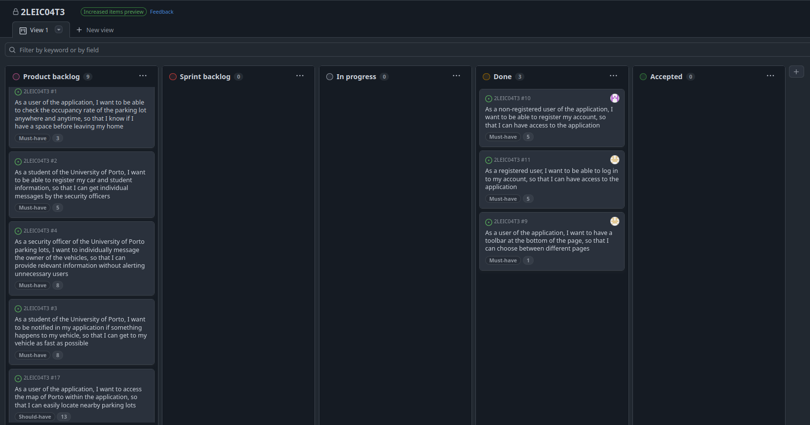
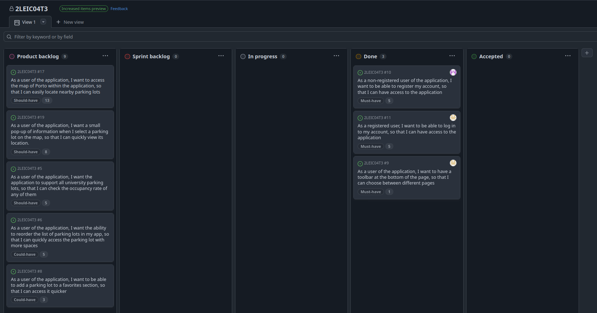

### Sprint 0

#### Retrospective

* **Did well**:
  * **Effective Communication**: We kept an open and effective communication flow, making collaboration smooth and keeping everyone connected.
  * **Adaptability**: The team efficiently ajusted to the new worflow and tools. 
  * **Design and Development Kickoff**: We successfully created initial mockups and began building the app in a fast-paced develoment process, enabling us to quicky move from ideation to execution.
* **Do differently**:
  * **Define clearer Sprint Goals**: Establish more specific objectives for the next sprint to measure progress more effectively.
* **Puzzles**:
  * **Task Distribution**: We're figuring out the best way to divide the upcoming tasks so that everyone has a fair and manageable workload.
  * **Implementing the Chat System**: We still have some doubts about the best approach to integrating the chat functionality.

#### Project Board

  <h3> End of Sprint 0 </h3>
  
<i>Progress overview at the end of the sprint</i>

  
  

