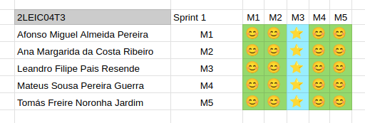

### Sprint 1

#### Retrospective

* **Did well**:
  * **Focused Delivery of Core Features**: We successfully developed features that cover key aspects of the app's functionality-car registration, messaging from security to students and vehicle-related notifications. These features are central to the app's purpose and show clear alignment with user needs.
  * **Accurate Estimation and Task Completion**: We estimated our workload realistically during Sprint Planning and managed to complete everything we committed to.
* **Do differently**:
  * **Improved Task Separation**: We need to break tasks down into smaller, more independent units so that each task can be worked on without waiting for the completion of others.
* **Puzzles**:
  * **Concerns about Integrating Google Maps Navigation**: We have uncertainties about whether it’s possible to integrate the Google Maps navigation system into our app. Additionally, we need to assess if this integration is feasible within the scope of the current sprint.

#### Happiness Meter

  
 Review of the sprint 1 

  

#### Project Board

  <h3> Start of Sprint 1 </h3>
  
<i>Progress overview at the start of the sprint</i>

  

  <h3> End of Sprint 1 </h3>
  
<i>Progress overview at the end of the sprint</i>

  

