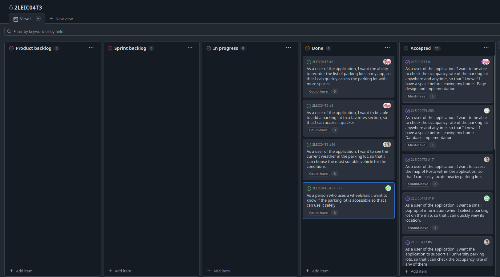

### Sprint 3

#### Retrospective

* **Did well**:
    * **Feature Completion**: We successfully implemented the final set of user stories in this sprint, delivering features that make the application more tailored, responsive, and user-focused. Users can now reorder the list of parking lots based on availability, allowing for quicker and more informed decisions when searching for a spot. The addition of a personalized favorites section enables users to easily save and access frequently used parking lots, enhancing overall convenience.

    * **User-Centric Enhancements**: Beyond usability improvements, we introduced real-time weather information, displayed when selecting a parking lot on the map—empowering users to plan ahead based on current conditions. We also implemented an accessibility enhancement that shows whether a parking lot is wheelchair accessible, promoting safer and more inclusive use of the app for individuals with mobility challenges.

    * **Attention to Design and Detail**:This sprint was marked by a heightened focus on refinement. In addition to completing major tasks, we addressed subtle design inconsistencies and UI issues. This attention to detail resulted in a smoother, more polished user experience.

* **Did poorly**:
    * **Underestimated External Dependencies**: We assumed full compatibility with the Google Maps API for retrieving weather data without verifying all necessary capabilities upfront. This led to unexpected integration issues mid-sprint and required us to pivot to alternate data sources. Earlier technical validation would have helped avoid this disruption.

* **Do differently**:
    * **Plan for External API Dependencies**: In future projects, we’ll assess third-party services more thoroughly before integration. This includes confirming their functionality, limitations, and potential costs early in the planning process to reduce risks and mitigate last-minute changes.

#### Hapiness Meter

  
 Review of the sprint 3 

  

#### Project Board

  <h3> Start of Sprint 3 </h3>
  
<i>Progress overview at the start of the sprint</i>

  

  <h3> End of Sprint 3 </h3>
  
<i>Progress overview at the end of the sprint</i>

  

